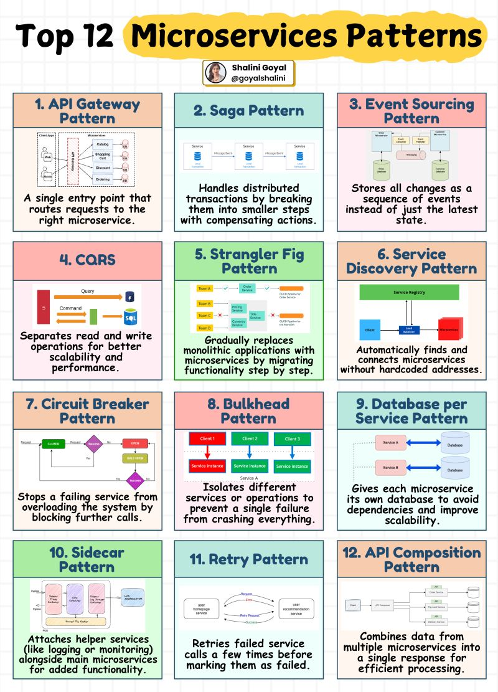

Microservices architecture is all about scalability, resilience, and efficiency—but without the right design patterns, things can get messy fast!

Here are 12 essential microservices patterns every developer should know:
|Patterns| Diagram|
|--|--|
|1. API Gateway Pattern – A single entry point that routes requests to the right microservice. 2. Saga Pattern – Breaks distributed transactions into smaller steps with compensating actions.   3. Event Sourcing Pattern – Stores all changes as a sequence of events instead of just the latest state.   4. CQRS – Separates read and write operations for better scalability and performance.   5. Strangler Fig Pattern – Gradually replaces monolithic applications with microservices.   6. Service Discovery Pattern – Automatically finds and connects microservices without hardcoded addresses.   7. Circuit Breaker Pattern – Stops a failing service from overloading the system by blocking further calls. | 